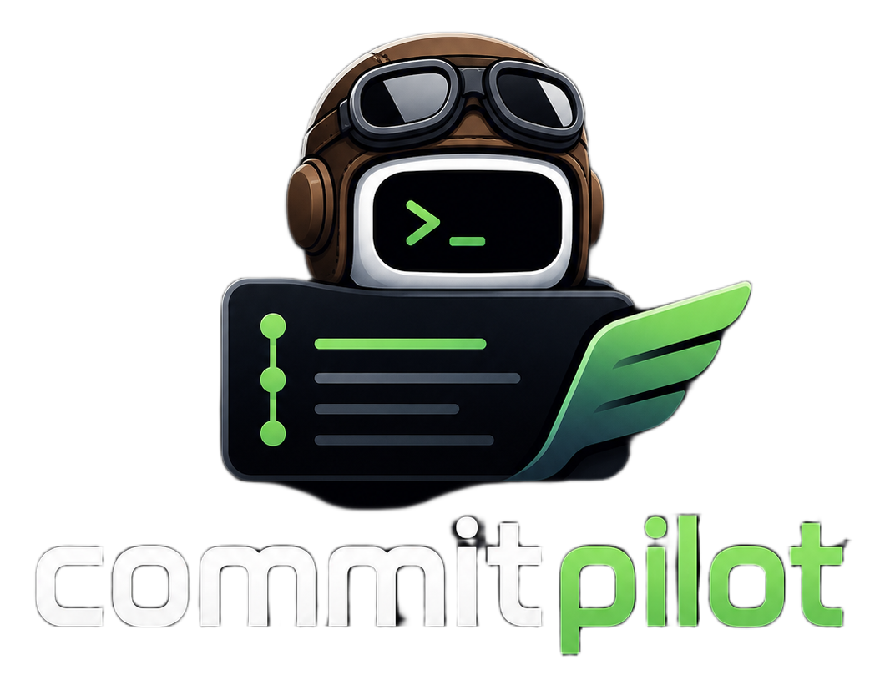

# CommitPilot

<p align="center">
  
</p>

**Stop burning tokens on commit messages.**

AI-powered git commit message generator that runs locally or against any LLM provider. Reads your staged diff, follows your rules, and outputs a clean [Conventional Commit](https://www.conventionalcommits.org/) — then asks before it commits.

---

## Install

```bash
npm install -g commitpilot
```

---

## Quick start

```bash
# 1. Initialize CommitPilot in your repo
commitpilot init

# 2. Edit .commitpilot.yml to point at your provider
#    (it's already gitignored — safe for API keys)

# 3. Stage your changes and generate a commit
git add .
commitpilot c
```

---

## Commands

### `commitpilot init`

Sets up CommitPilot in the current repository.

- Creates `.commitpilot.yml` with provider configuration
- Creates `.commitpilot.md` with Conventional Commits instructions
- Adds `.commitpilot.yml` to `.gitignore` automatically
- Never overwrites `.commitpilot.md` if it already exists

```bash
commitpilot init
```

### `commitpilot commit` · alias `commitpilot c`

Reads your staged diff, generates a commit message via your configured LLM, shows it to you, and asks for confirmation before running `git commit`.

```bash
commitpilot commit
commitpilot c        # short alias

# Override config or instructions for a single run
commitpilot c --config path/to/.commitpilot.yml
commitpilot c --instructions path/to/rules.md
commitpilot c --verbose
```

---

## Configuration (`.commitpilot.yml`)

This file is **gitignored by default** — safe to store API keys.

```yaml
provider: ollama
model: qwen2.5-coder:7b
baseUrl: http://localhost:11434
apiKey: null
timeoutMs: 30000
temperature: 0.2
maxTokens: 512
```

### Supported providers

| Provider | `provider` value | Default `baseUrl` |
|---|---|---|
| [Ollama](https://ollama.com) (local) | `ollama` | `http://localhost:11434` |
| [OpenAI](https://platform.openai.com) | `openai` | `https://api.openai.com/v1` |
| [OpenRouter](https://openrouter.ai) | `openrouter` | `https://openrouter.ai/api/v1` |
| [Anthropic](https://www.anthropic.com) | `anthropic` | `https://api.anthropic.com` |

#### Ollama (local, no cost)

```yaml
provider: ollama
model: qwen2.5-coder:7b
baseUrl: http://localhost:11434
```

#### OpenAI

```yaml
provider: openai
model: gpt-4o-mini
apiKey: sk-...
```

#### OpenRouter

```yaml
provider: openrouter
model: mistralai/mistral-7b-instruct
apiKey: sk-or-...
```

#### Anthropic

```yaml
provider: anthropic
model: claude-haiku-4-5-20251001
apiKey: sk-ant-...
```

API keys can also be set via environment variables:
`OPENAI_API_KEY`, `OPENROUTER_API_KEY`, `ANTHROPIC_API_KEY`

---

## Customizing commit rules (`.commitpilot.md`)

This file is committed to your repo and shared with your team. It contains the instructions sent to the LLM on every run. Edit it to enforce your project's conventions.

The default template follows the full [Conventional Commits v1.0.0](https://www.conventionalcommits.org/en/v1.0.0/) spec, including:

- All standard types (`feat`, `fix`, `refactor`, `chore`, `perf`, `ci`…)
- Scope guidelines
- Subject line rules (imperative, lowercase, 72 chars)
- Body and footer usage
- Breaking change format (`feat!:` + `BREAKING CHANGE:` footer)
- A decision guide and concrete examples

---

## How it works

```
git add <files>
       │
       ▼
commitpilot commit
       │
       ├─ reads .commitpilot.yml   → provider + model config
       ├─ reads .commitpilot.md    → commit rules for the LLM
       ├─ runs git diff --cached   → staged changes only
       │
       ▼
    LLM prompt
       │
       ▼
  generated message
       │
  shown to user
       │
  [y/n] confirm?
       │
       ▼
  git commit -m "..."
```

Only staged changes are used — what you `git add` is what gets described.

---

## Requirements

- Node.js 18+
- Git
- A running LLM provider (Ollama locally, or an API key for cloud providers)

---

## License

MIT © [Lucian Caetano](https://github.com/lucian-caetano)
